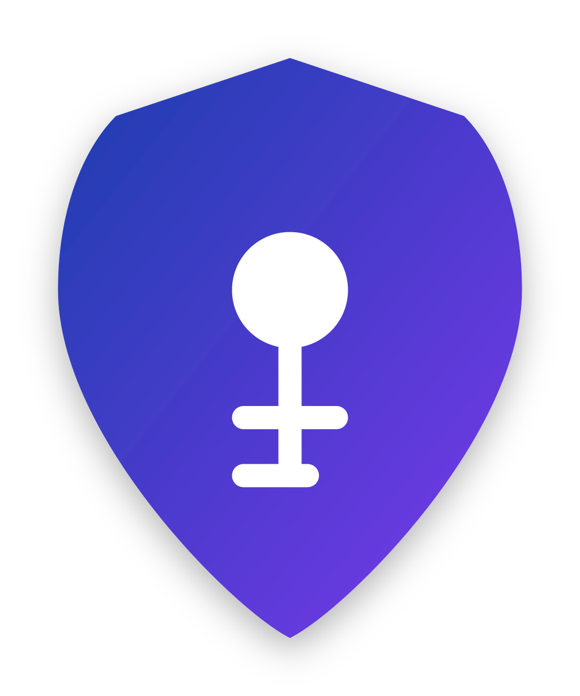

# CleanIAM Management Portal UI


A modern administration interface for the CleanIAM OpenID Connect server. Built with React, TypeScript, and Tailwind CSS.

[](LICENSE)
[](https://reactjs.org/)
[](https://www.typescriptlang.org/)
[](https://tailwindcss.com/)

## 🌟 Features

- **Comprehensive Admin Interface**: Complete management portal for CleanIAM services
- **Tenant Management**: Create and manage multi-tenant configurations
- **Application Management**: Register and configure OAuth/OIDC client applications
- **User Administration**: User creation, role assignment, and profile management
- **Scope Management**: Define and manage OAuth scopes and permissions
- **Security Settings**: Configure MFA, session policies, and security features

## 🏗️ Architecture

Built with a modern React stack:

- **React**: Utilizing the latest React features and hooks
- **TypeScript**: Type-safe development experience
- **Vite**: Fast, modern build tooling
- **React Router**: For application routing
- **Zod**: Schema validation for all forms
- **React Hook Form**: Form handling with validation
- **React Query**: Data fetching and caching
- **Tailwind CSS**: Utility-first styling
- **OIDC Client**: Secure authentication with the OIDC server

## 🚀 Getting Started

### Prerequisites

- Node.js 20.x or later
- npm or Bun package manager
- CleanIAM OIDC server running (for API connectivity)

### Installation

```bash
# Clone the repository
git clone https://github.com/cleaniam/cleaniam-management-portal.git
cd cleaniam-management-portal

# Install dependencies
npm install
# or
bun install
```

### Configuration

Create a `.env` file in the root directory with the following variables:

```
VITE_API_BASE_URL=https://your-cleaniam-server-url/api
```

For production, update the `.env.production` file.

### Development

```bash
# Start development server
npm run dev
# or
bun run dev
```

### Building for Production

```bash
# Create production build
npm run build
# or
bun run build

# Preview production build locally
npm run preview
# or
bun run preview
```

## 📝 API Generation

The project uses Orval to automatically generate type-safe API clients from the OpenAPI specifications provided by the CleanIAM server.

- Update the schema in `src/lib/api/open-api/swagger.json` with the latest OpenAPI spec from the CleanIAM server.

- Run the following command to generate the API client code:

```bash
# Generate API client code
npm run api-generate
# or
bun run api-generate
```

This creates strongly-typed API clients in `src/lib/api/generated/` for interacting with the CleanIAM backend.

## 🔒 Authentication

The portal uses OIDC authentication with the CleanIAM server itself, demonstrating a real-world implementation of the protocol:

- **OpenID Connect**: Full implementation of the authentication code flow with PKCE
- **Role-based Access**: Different sections of the portal are protected by role guards
- **Access Tokens**: JWT handling for secure API authorization
- **Refresh Tokens**: Automatic token refresh for sessions

## 📱 Interface Elements

### Main Sections

- **Dashboard**: Overview of system status and key metrics
- **Applications**: Manage OAuth/OIDC client applications
- **Users**: User management with role assignment
- **Tenants**: Multi-tenant configuration
- **Scopes**: OAuth scope definitions and permissions
- **Profile**: User profile and security settings

### Key Components

- **Data Tables**: Interactive tables with sorting, filtering, and pagination
- **Forms**: User-friendly forms with real-time validation
- **Dialogs**: Context-sensitive dialogs for operations
- **Toast Notifications**: User feedback for actions
- **Role Guards**: Component-level access control

## 🔍 Folder Structure

Key directories in the project:

- `src/components/` - UI components organized by domain
- `src/pages/` - Top-level page components
- `src/lib/api/` - API integration and generated clients
- `src/lib/hooks/` - Custom React hooks
- `src/lib/schemas/` - Zod validation schemas
- `src/utils/` - Utility functions and constants

## 🤝 Contributing

Contributions are welcome! Please feel free to submit a Pull Request.

## 📝 License

This project is licensed under the MIT License - see the LICENSE file for details.

---

<p align="center">
  
</p>
<p align="center">
  Developed as part of a Master's Thesis © 2025
</p>
